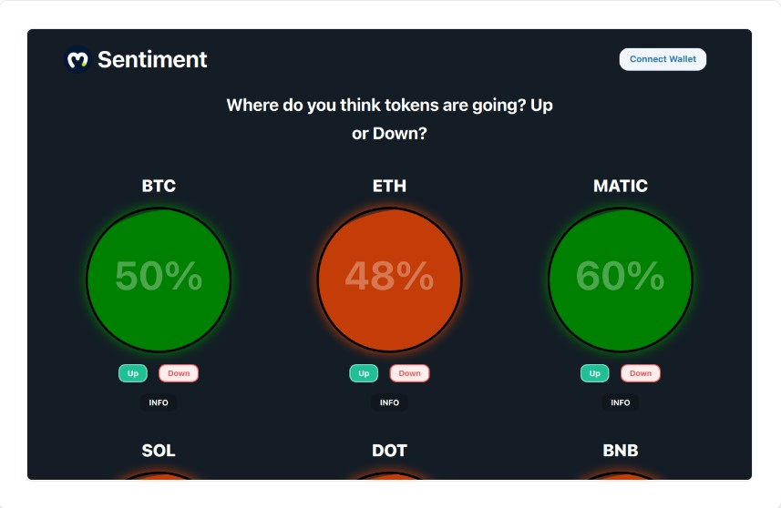

# [Market Sentiment DApp](https://market-sentiment.vercel.app/)
*Market Sentiment* is a decentalized application that used blockchain technology to store sentiment data of various Cryptocurrency Token.  

Here is the app [Market Sentiment](https://market-sentiment.vercel.app/)

[](https://market-sentiment.vercel.app/)

## Technology Used
- Programming Language: **Solidity**
- Framework: **Hardhat**
- Frontend: **React**
- Tool: **Moralis** 

## Command and Instruction
You need to have metamask installed in your browser and connect to Goerli Ethereum testnet. You also need to have some testnet **GoerliETH** tokens for voting.

```shell
yarn hardhat help
yarn hardhat test
GAS_REPORT=true yarn hardhat test
yarn hardhat node
yarn hardhat run scripts/deploy.js
```

MarketSentiment deployed to:
- Goerli Testnet : **0x2D53A50bd9A9c26b7597DE744De3Cd352B4D7d6B**
- View it on [Goerli Etherscan](https://goerli.etherscan.io/address/0x2D53A50bd9A9c26b7597DE744De3Cd352B4D7d6B#code).
